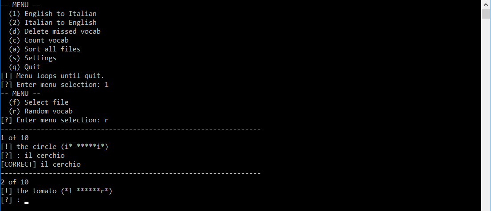

# ReviewVocab

## Introduction
This a Python CLI script for reviewing foreign language vocab.

## Requirements
Python 3.6+ is required. Additional third-party libraries are required and can be installed using the following command: `pip install -r requirements.txt`

## Usage
A set of vocab files are required. Example English/Italian vocab files are provided in [ItalianVocab](https://github.com/jeffrimko/ItalianVocab).

Vocab files are formatted as follows:

  - Vocab files use the `.txt` extension.
  - Each line is a single vocab entry.
  - Vocab entry lines use the format: `<lang1>;<lang2>`
      * Example: `hello;ciao`
  - Synonyms are separated with a `/`.
      * Example: `goodbye;addio/ciao`
  - Append additional info in parenthesis.
      * Example: `hello (formal);buongiorno`
  - Literal translations are shown in parenthesis prefixed with `lit`:
      * Example: `good luck (lit: in the mouth of the wolf);in bocca al lupo`

The `config.yaml` file top-level `path` key points to the location of the vocab files. Additional keys are provided for various features of the script:

  - Number of vocab to review.
  - Redo missed answers.
  - Enabling hint characters.
  - Enabling text-to-speech.
